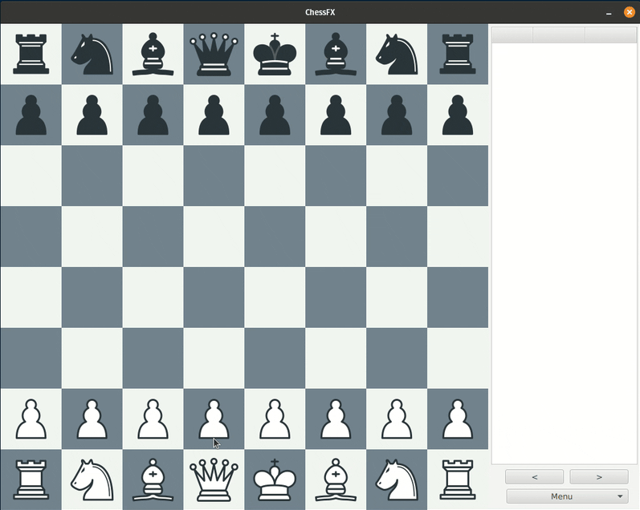
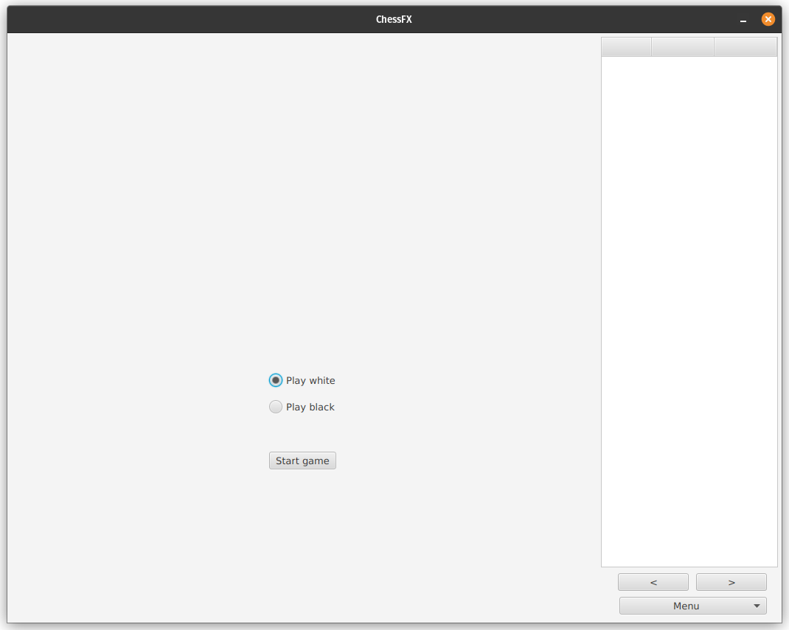
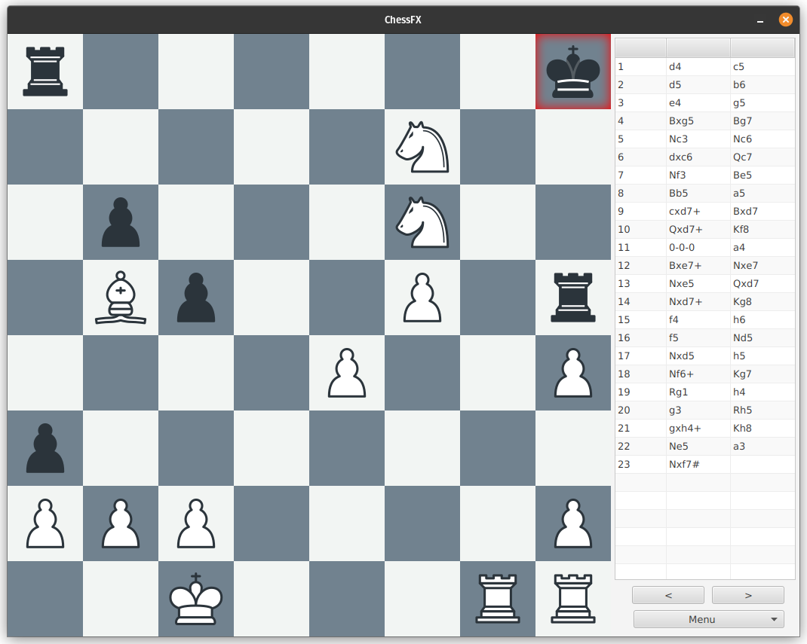
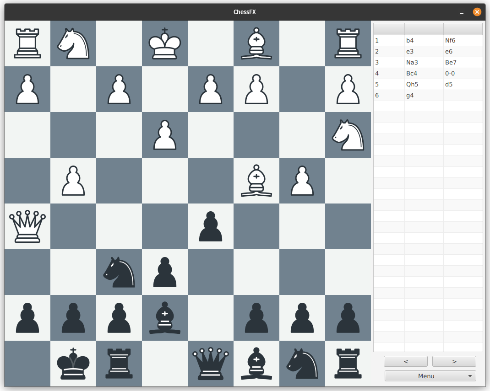
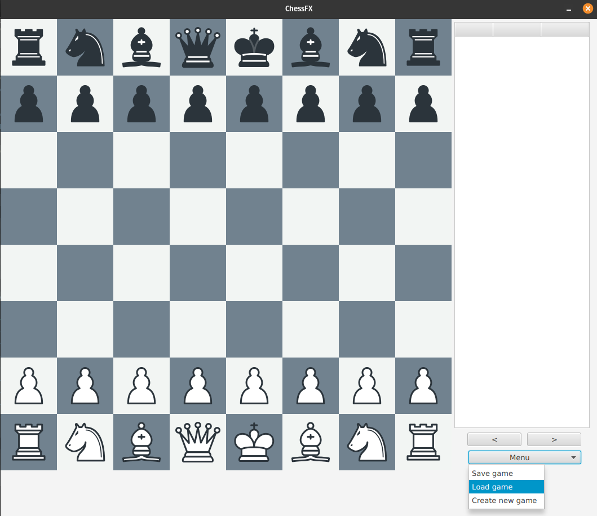

# ChessFX

A chess application written in JavaFX. This was my semester project for [TDT4100 Object-Oriented Programming](https://www.ntnu.edu/studies/courses/TDT4100) at NTNU.

## Features

- All moves are recorded using [chess notation](https://en.wikipedia.org/wiki/Chess_notation).
- Legal moves are highlighted when clicking a piece.
- The user can choose playing color.
- The computer always plays a random legal move.
- Pieces are automatically centered to their destination square.
- Games can be saved to disk and continued later.
- Castling is implemented, but pawn promotion and *en passant* are not.

<table>
  <tr>
    <td>
      <p align="center">
        <b>GIF of gameplay</b><br>
        <br>
        <em>(The computer doesn't always play the best move.)</em>
      </p>
    </td>
  </tr>
</table>

## Technical overview

### Built with Apache Maven
[Apache Maven](https://maven.apache.org/) is used to configure and run the application. This was an administrative requirement. The project is therefore built using its project object model (see [pom.xml](./pom.xml)) and a set of plugins (like [JavaFX](https://openjfx.io), [JUnit](https://junit.org/) and [JaCoCo](https://www.jacoco.org/)).

### Model-View-Controller Principle
The application is written according to the [Model-View-Controller principle](https://en.wikipedia.org/wiki/Model%E2%80%93view%E2%80%93controller).
- **chessfx.game** is responsible for the game logic and the current state.
- **chessfx.ui** represents the current state in the user interface.
  - The window layout is defined in an .fxml file while a separate controller class processes user interaction.
- **chessfx.persistence** can save and load the games from disk.


### Automated testing

Tests are written using [JUnit 5](https://junit.org/junit5/) and test coverage is reported using the [JaCoCo Maven Plug-In](https://www.jacoco.org/jacoco/trunk/doc/maven.html). The methods in the user interface is not tested.

| Element             | Missed instructions                                                                                                                                   | Coverage | Missed branches                                                                                                                                       | Coverage | Methods | Classes |
| :------------------ | :---------------------------------------------------------------------------------------------------------------------------------------------------- | :------: | :---------------------------------------------------------------------------------------------------------------------------------------------------- | :------: | :-----: | :-----: |
| chessfx.game        | :green_square: :green_square: :green_square: :green_square: :green_square: :green_square: :green_square: :green_square: :green_square: :red_square:   |   90%    | :green_square: :green_square: :green_square: :green_square: :green_square: :green_square: :green_square: :green_square: :red_square: :red_square:     |   81%    |   75    |   10    |
| chessfx.game.pieces | :green_square: :green_square: :green_square: :green_square: :green_square: :green_square: :green_square: :green_square: :green_square: :green_square: |   98%    | :green_square: :green_square: :green_square: :green_square: :green_square: :green_square: :green_square: :green_square: :green_square: :green_square: |   99%    |   25    |    6    |
| chessfx.persistence | :green_square: :green_square: :green_square: :green_square: :green_square: :green_square: :green_square: :green_square: :green_square: :red_square:   |   94%    | :green_square: :green_square: :green_square: :green_square: :green_square: :green_square: :green_square: :green_square: :green_square: :red_square:   |   85%    |    6    |    1    |
| **Total**           |                                                                                                                                                       | **92%**  |                                                                                                                                                       | **88%**  | **106** | **17**  |

#### Example test: Checkmate

The below test includes some given setup moves, a verification that the moves were processed correctly, and test of the game state before and after a subsequent checkmating-move (expecting the state to change from `ActiveGame` to `BlackWin`).

```java
public class MoveTest {
    private Game game;
    private List<Move> moveList;

    @BeforeEach()
    public void setup() {
        game = new Game(true);
        game.move("e2", "e4");  // 1. e4
        game.move("e7", "e5");  // 1… e5
        game.move("g1", "f3");  // 2. Nf3
        game.move("b8", "c6");  // 2… Nc6
        game.move("f1", "c4");  // 3. Bc4
        game.move("d8", "h4");  // 3… Qh4
        game.move("d2", "d3");  // 4. d3
        game.move("g8", "f6");  // 4… Nf6
        game.move("c1", "g5");  // 5. Bg5
        game.move("f6", "g4");  // 5… Ng4
        game.move("f3", "e5");  // 6. Nxe5
        moveList = game.getMoveList();
    }

    @Test
    public void testIntegrityOfSetupFunction() {
        assertTrue(moveList.size() == 11);
        List<String> notation = Arrays.asList("e4", "e5", "Nf3", "Nc6", "Bc4", "Qh4", "d3", "Nf6", "Bg5", "Ng4", "Nxe5");
        for (int i = 0; i < 11; i++) {
            assertEquals(notation.get(i), moveList.get(i).getNotation());   // Check notation
            assertEquals((i / 2) + 1, moveList.get(i).getMoveCount());      // Check move count
        }
    }

    @Test
    public void testCheckMateQxf7() {
        assertTrue(game.getGameStatus() == GameStatus.ActiveGame);
        game.move("h4", "f2");  // 6… Qxf2#
        assertTrue(game.getGameStatus() == GameStatus.BlackWin);
    }

    // More tests
}
```


### File structure
```
📦chessfx
 ┣ 📂src
 ┃ ┣ 📂main
 ┃ ┃ ┣ 📂java
 ┃ ┃ ┃ ┣ 📂chessfx
 ┃ ┃ ┃ ┃ ┣ 📂game
 ┃ ┃ ┃ ┃ ┃ ┣ 📂pieces
 ┃ ┃ ┃ ┃ ┃ ┃ ┣ 📜Bishop.java
 ┃ ┃ ┃ ┃ ┃ ┃ ┣ 📜King.java
 ┃ ┃ ┃ ┃ ┃ ┃ ┣ 📜Knight.java
 ┃ ┃ ┃ ┃ ┃ ┃ ┣ 📜Pawn.java
 ┃ ┃ ┃ ┃ ┃ ┃ ┣ 📜Queen.java
 ┃ ┃ ┃ ┃ ┃ ┃ ┗ 📜Rook.java
 ┃ ┃ ┃ ┃ ┃ ┣ 📜Board.java
 ┃ ┃ ┃ ┃ ┃ ┣ 📜Game.java
 ┃ ┃ ┃ ┃ ┃ ┣ 📜Move.java
 ┃ ┃ ┃ ┃ ┃ ┣ 📜ObservableMovePair.java
 ┃ ┃ ┃ ┃ ┃ ┣ 📜Piece.java
 ┃ ┃ ┃ ┃ ┃ ┣ 📜Square.java
 ┃ ┃ ┃ ┃ ┃ ┗ 📜ValidateMove.java
 ┃ ┃ ┃ ┃ ┣ 📂persistence
 ┃ ┃ ┃ ┃ ┃ ┣ 📜SaveLoadAgent.java
 ┃ ┃ ┃ ┃ ┃ ┗ 📜SaveLoadInterface.java
 ┃ ┃ ┃ ┃ ┗ 📂ui
 ┃ ┃ ┃ ┃ ┃ ┣ 📜BoardFX.java
 ┃ ┃ ┃ ┃ ┃ ┣ 📜ChessFXApp.java
 ┃ ┃ ┃ ┃ ┃ ┣ 📜ChessFXController.java
 ┃ ┃ ┃ ┃ ┃ ┣ 📜PieceFX.java
 ┃ ┃ ┃ ┃ ┃ ┗ 📜SquareFX.java
 ┃ ┃ ┃ ┗ 📜module-info.java
 ┃ ┃ ┗ 📂resources
 ┃ ┃ ┃ ┗ 📂chessfx
 ┃ ┃ ┃ ┃ ┗ 📂ui
 ┃ ┃ ┃ ┃ ┃ ┣ 📂pieces
 ┃ ┃ ┃ ┃ ┃ ┃ ┣ 📂black_png
 ┃ ┃ ┃ ┃ ┃ ┃ ┃ ┣ 📜bishop.png
 ┃ ┃ ┃ ┃ ┃ ┃ ┃ ┣ 📜king.png
 ┃ ┃ ┃ ┃ ┃ ┃ ┃ ┣ 📜knight.png
 ┃ ┃ ┃ ┃ ┃ ┃ ┃ ┣ 📜pawn.png
 ┃ ┃ ┃ ┃ ┃ ┃ ┃ ┣ 📜queen.png
 ┃ ┃ ┃ ┃ ┃ ┃ ┃ ┗ 📜rook.png
 ┃ ┃ ┃ ┃ ┃ ┃ ┗ 📂white_png
 ┃ ┃ ┃ ┃ ┃ ┃ ┃ ┣ 📜bishop.png
 ┃ ┃ ┃ ┃ ┃ ┃ ┃ ┣ 📜king.png
 ┃ ┃ ┃ ┃ ┃ ┃ ┃ ┣ 📜knight.png
 ┃ ┃ ┃ ┃ ┃ ┃ ┃ ┣ 📜pawn.png
 ┃ ┃ ┃ ┃ ┃ ┃ ┃ ┣ 📜queen.png
 ┃ ┃ ┃ ┃ ┃ ┃ ┃ ┗ 📜rook.png
 ┃ ┃ ┃ ┃ ┃ ┗ 📜App.fxml
 ┃ ┗ 📂test
 ┃ ┃ ┗ 📂java
 ┃ ┃ ┃ ┗ 📂chessfx
 ┃ ┃ ┃ ┃ ┣ 📂game
 ┃ ┃ ┃ ┃ ┃ ┣ 📜BoardTest.java
 ┃ ┃ ┃ ┃ ┃ ┣ 📜MoveTest.java
 ┃ ┃ ┃ ┃ ┃ ┗ 📜SquareTest.java
 ┃ ┃ ┃ ┃ ┣ 📂persistence
 ┃ ┃ ┃ ┃ ┃ ┗ 📜SaveLoadAgentTest.java
 ┣ 📜pom.xml
 ```

 ## Screenshots
<table align="center">
  <tr>
    <td>
      <p align="center">
        <b>Menu</b><br>
        
      </p> 
    </td>
  </tr>
  <tr>
    <td>
      <p align="center">
        <b>White player perspective</b><br>
        
      </p>
    </td>
  </tr>
    <tr>
    <td>
      <p align="center">
        <b>Black player perspective</b><br>
        
      </p>
    </td>
  </tr>
  <tr>
    <td>
      <p align="center">
        <b>Dropdown menu</b><br>
        
      </p> 
    </td>
  </tr>
</table>